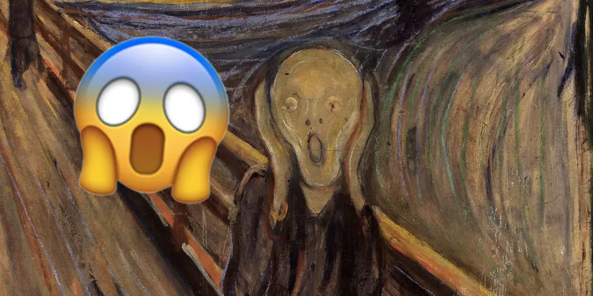

# 🎨 The Scream  
**Interactive Animation – p5.js (User Input Prototype)**  
by **Mjay (Myeonghee) Kim**  
Master of Interaction Design & Electronic Arts – The University of Sydney (USYD)  
2025 Individual Coding Task

---

## 🧠 Project Description

- **Group Project**

    The group project visualises the overwhelming stress of students buried in endless assignments.  
    Instead of simply showing Munch’s screaming figure, the user becomes the protagonist through a live camera feed.  
    The video is pixelated and blended naturally with Munch’s painting to symbolise a fusion between the original artwork and the student’s own expression.  
    The added text *“I forgot ddl”* enhances the emotional impact and humour of the piece.  

---

- **Individual Project**

  The individual project extends this static group work by adding a **user input interaction system**.  
  The screaming face was transformed into a character that reacts to the user’s actions.  
  When the mouse is held down, energy accumulates and then bursts out to amplify the emotional tension,  
  while clicking releases visible shockwaves for a stronger visual effect.  
  The moving face introduces a playful, game-like element by allowing the user to control its movement within the canvas using the keyboard.  

The goal is to transform emotional tension into a tangible, visual, and personal interaction.

---

## 💡 Inspiration & References

**Visual Inspiration:**
Munch, E. (1893). *The Scream* [Painting]. The National Gallery, Oslo. 

Robert Silvers (2022). *Alien* [Photomosaic]

Christofaro, B. (2019, March 21). The figure in Edvard Munch’s iconic ‘The Scream,’ which inspired an emoji, is not actually screaming, according to the British Museum. Business Insider.

[source](https://www.businessinsider.com/british-museum-man-artwork-inspired-scream-emoji-not-screaming-2019-3)

Through Robert Silvers (2022)’s *Alien*, I was inspired to characterise the screaming figure from *The Scream* in a more playful and stylised way. While viewing the image from Christofaro (2019)’s article, I imagined placing the screaming character floating above the painting itself. These references together inspired me to incorporate user input into the character’s facial expression, making the act of screaming more dynamic and dramatic.

---

## 🕹️ Interaction Instructions

| Input | Description |
|--------|--------------|
| **Hold Mouse** | Charge emotional energy — the face changes colour from calm beige to red and violet. |
| **Release Mouse** | Trigger a “scream” — releasing a visible shockwave that expands across the canvas. |
| **W / A / S / D** or **Arrow Keys** | Move the face around the screen. |
| **Shift** | Move faster (adds intensity). |
| **H** | Toggle help message. |
| **R** | Reset animation to its initial state. |

💡 *Tip:* Move the mouse while charging to create more dynamic shockwave paths.

---

## 🧩 Individual Approach

I chose **interaction** as my driver.  
My focus was to make the experience directly *reactive* to user gestures — transforming user input into emotion.

---

## 🌈 Animation Method

| Animated Property | Behaviour |
|--------------------|------------|
| **Colour** | The face’s skin colour shifts smoothly from beige → orange → red → violet, representing emotional intensity. |
| **Size** | The mouth height increases with charge (more emotion = bigger scream). |
| **Position** | Controlled with WASD or arrow keys, allowing free movement. |
| **Shockwave** | Expanding circle visualises the emotional release when the mouse is released. |
| **Background Tint** | Slowly shifts from dark blue to warm red, adding atmospheric emotion. |

This approach ensures the result feels *emotionally alive* and clearly distinct from other members’ visual effects (which may focus on noise, opacity, or fragment animation).

---

## ⚙️ Technical Explanation

**Technology:** [p5.js](https://p5js.org)  
**Language:** JavaScript (Global mode)  
